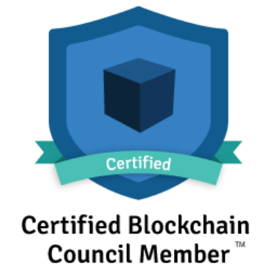
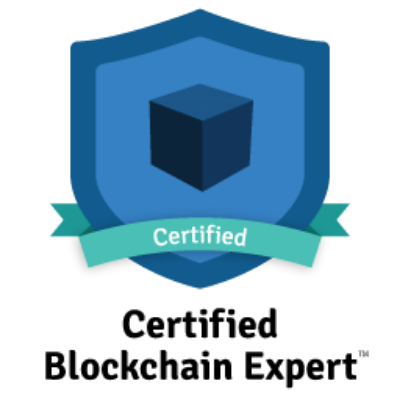

  
  

# My Awesome Blockchain
My Awesome Blockchain

## --- my blockchain concil badges ---

## Polygon
##### Polygon is a protocol and a framework for building and connecting Ethereum-compatible blockchain networks. Aggregating scalable solutions on Ethereum supporting a multi-chain Ethereum ecosystem.

https://polygon.technology/

https://polygon.technology/get-started/

https://awesomepolygon.com/

https://wallet.polygon.technology/

https://docs.polygon.technology/

https://chainstack.com/

https://chainstack.com/build-better-with-polygon/

https://rpc.maticvigil.com/

https://polygonscan.com/

https://matic.supply/

https://faucet.polygon.technology/

## Web3 JS - Ethereum JavaScript API
##### web3.js is a collection of libraries that allow you to interact with a local or remote ethereum node using HTTP, IPC or WebSocket.

https://web3js.readthedocs.io/en/v1.5.2/

## Ethers JS
##### The ethers.js library aims to be a complete and compact library for interacting with the Ethereum Blockchain and its ecosystem. It was originally designed for use with ethers.io and has since expanded into a more general-purpose library.

https://docs.ethers.io/v5/

## IPFS
##### IPFS powers the Distributed Web. A peer-to-peer hypermedia protocol. Designed to preserve and grow humanity's knowledge by making the web upgradeable, resilient, and more open.

https://ipfs.io/

## Chainlink
##### Securely connect smart contracts with off-chain data and services. Chainlink decentralized oracle networks provide tamper-proof inputs, outputs, and computations to support advanced smart contracts on any blockchain.

https://chain.link/

## Swarm
##### Swarm is a system of peer-to-peer networked nodes that create a decentralised storage and communication service. The system is economically self-sustaining due to a built-in incentive system enforced through smart contracts on the Ethereum blockchain.

https://www.ethswarm.org/

## OpenZeppelin
##### The standard for secure blockchain applications. OpenZeppelin provides security products to build, automate, and operate decentralized applications. We also protect leading organizations by performing security audits on their systems and products.

https://openzeppelin.com/

https://openzeppelin.com/contracts/

https://docs.openzeppelin.com/contracts/4.x/

https://openzeppelin.com/defender/

https://docs.openzeppelin.com/defender/

/contracts/token/ERC721/

https://docs.openzeppelin.com/contracts/4.x/api/token/erc721

https://github.com/OpenZeppelin/openzeppelin-contracts/blob/master/contracts/token/ERC721/ERC721.sol

https://github.com/OpenZeppelin/openzeppelin-contracts/blob/master/contracts/token/ERC721/IERC721.sol

https://github.com/OpenZeppelin/openzeppelin-contracts/blob/master/contracts/token/ERC721/IERC721Receiver.sol

/contracts/token/ERC721/extensions/

https://github.com/OpenZeppelin/openzeppelin-contracts/blob/master/contracts/token/ERC721/extensions/ERC721Burnable.sol

https://github.com/OpenZeppelin/openzeppelin-contracts/blob/master/contracts/token/ERC721/extensions/ERC721Enumerable.sol

https://github.com/OpenZeppelin/openzeppelin-contracts/blob/master/contracts/token/ERC721/extensions/ERC721Pausable.sol

https://github.com/OpenZeppelin/openzeppelin-contracts/blob/master/contracts/token/ERC721/extensions/ERC721URIStorage.sol

https://github.com/OpenZeppelin/openzeppelin-contracts/blob/master/contracts/token/ERC721/extensions/IERC721Enumerable.sol

https://github.com/OpenZeppelin/openzeppelin-contracts/blob/master/contracts/token/ERC721/extensions/IERC721Metadata.sol

/contracts/token/ERC721/utils/

https://github.com/OpenZeppelin/openzeppelin-contracts/blob/master/contracts/token/ERC721/utils/ERC721Holder.sol

/contracts/token/ERC20/

https://docs.openzeppelin.com/contracts/4.x/api/token/erc20

https://github.com/OpenZeppelin/openzeppelin-contracts/blob/master/contracts/token/ERC20/ERC20.sol

https://github.com/OpenZeppelin/openzeppelin-contracts/blob/master/contracts/token/ERC20/IERC20.sol

/contracts/token/ERC20/extensions/

https://github.com/OpenZeppelin/openzeppelin-contracts/blob/master/contracts/token/ERC20/extensions/ERC20Burnable.sol

https://github.com/OpenZeppelin/openzeppelin-contracts/blob/master/contracts/token/ERC20/extensions/ERC20Capped.sol

https://github.com/OpenZeppelin/openzeppelin-contracts/blob/master/contracts/token/ERC20/extensions/ERC20FlashMint.sol

https://github.com/OpenZeppelin/openzeppelin-contracts/blob/master/contracts/token/ERC20/extensions/ERC20Pausable.sol

https://github.com/OpenZeppelin/openzeppelin-contracts/blob/master/contracts/token/ERC20/extensions/ERC20Snapshot.sol

https://github.com/OpenZeppelin/openzeppelin-contracts/blob/master/contracts/token/ERC20/extensions/ERC20Wrapper.sol

https://github.com/OpenZeppelin/openzeppelin-contracts/blob/master/contracts/token/ERC20/extensions/IERC20Metadata.sol

/contracts/token/ERC20/utils/

https://github.com/OpenZeppelin/openzeppelin-contracts/blob/master/contracts/token/ERC20/utils/SafeERC20.sol

https://github.com/OpenZeppelin/openzeppelin-contracts/blob/master/contracts/token/ERC20/utils/TokenTimelock.sol

/contracts/token/ERC1155/

https://docs.openzeppelin.com/contracts/4.x/api/token/erc1155

https://github.com/OpenZeppelin/openzeppelin-contracts/blob/master/contracts/token/ERC1155/ERC1155.sol

https://github.com/OpenZeppelin/openzeppelin-contracts/blob/master/contracts/token/ERC1155/IERC1155.sol

https://github.com/OpenZeppelin/openzeppelin-contracts/blob/master/contracts/token/ERC1155/IERC1155Receiver.sol

/contracts/token/ERC1155/extensions/

https://github.com/OpenZeppelin/openzeppelin-contracts/blob/master/contracts/token/ERC1155/extensions/ERC1155Burnable.sol

https://github.com/OpenZeppelin/openzeppelin-contracts/blob/master/contracts/token/ERC1155/extensions/ERC1155Pausable.sol

https://github.com/OpenZeppelin/openzeppelin-contracts/blob/master/contracts/token/ERC1155/extensions/ERC1155Supply.sol

https://github.com/OpenZeppelin/openzeppelin-contracts/blob/master/contracts/token/ERC1155/extensions/IERC1155MetadataURI.sol

/contracts/token/ERC1155/utils/

https://github.com/OpenZeppelin/openzeppelin-contracts/blob/master/contracts/token/ERC1155/utils/ERC1155Holder.sol

https://github.com/OpenZeppelin/openzeppelin-contracts/blob/master/contracts/token/ERC1155/utils/ERC1155Receiver.sol

/contracts/access/

/contracts/security/

/contracts/utils/

/test/token/ERC721/

https://github.com/OpenZeppelin/openzeppelin-contracts/blob/master/test/token/ERC721/ERC721.test.js

https://github.com/OpenZeppelin/openzeppelin-contracts/blob/master/test/token/ERC721/ERC721.behavior.js

https://github.com/OpenZeppelin/openzeppelin-contracts/blob/master/test/token/ERC721/ERC721Enumerable.test.js

/test/token/ERC20/

https://github.com/OpenZeppelin/openzeppelin-contracts/blob/master/test/token/ERC20/ERC20.test.js

https://github.com/OpenZeppelin/openzeppelin-contracts/blob/master/test/token/ERC20/ERC20.behavior.js

https://github.com/OpenZeppelin/openzeppelin-contracts/blob/master/contracts/mocks/ERC20Mock.sol

https://github.com/OpenZeppelin/openzeppelin-contracts/blob/master/contracts/mocks/ERC20DecimalsMock.sol

https://docs.openzeppelin.com/test-helpers/0.5/

https://docs.openzeppelin.com/test-helpers/0.5/api

https://www.npmjs.com/package/@openzeppelin/test-helpers

/test/token/ERC1155/

https://github.com/OpenZeppelin/openzeppelin-contracts/blob/master/test/token/ERC1155/ERC1155.test.js

https://github.com/OpenZeppelin/openzeppelin-contracts/blob/master/test/token/ERC1155/ERC1155.behavior.js

## MythX
##### Smart contract security service for Ethereum. MythX™ by ConsenSys Software Inc™ is the premier security analysis service for Ethereum smart contracts. Our mission is to ensure development teams avoid costly errors and make Ethereum a more secure and trustworthy platform.

https://mythx.io/

## SmartCheck Security 
##### Security Analysis using Static analyzers – SmartCheck Security

## Truffle Suite
##### Sweet Tools for Smart Contracts. The Truffle Suite gets developers from idea to dapp as comfortably as possible.

https://trufflesuite.com/index.html

https://trufflesuite.com/docs/truffle/getting-started/interacting-with-your-contracts.html

https://trufflesuite.com/docs/truffle/getting-started/using-truffle-develop-and-the-console.html

## MetaMask
##### A crypto wallet & gateway to blockchain apps. MetaMask provides the simplest yet most secure way to connect to blockchain-based applications. You are always in control when interacting on the new decentralized web.

https://metamask.io/

https://docs.metamask.io/guide/ethereum-provider.html#legacy-methods

https://docs.metamask.io/guide/rpc-api.html#mobile-specific-rpc-methods

https://docs.metamask.io/guide/signing-data.html#sign-typed-data-v1

https://docs.metamask.io/guide/registering-function-names.html#verify

https://docs.metamask.io/guide/registering-your-token.html#example

https://docs.metamask.io/guide/defining-your-icon.html

https://docs.metamask.io/guide/onboarding-library.html#examples

https://docs.metamask.io/guide/mobile-best-practices.html#the-provider-window-ethereum

## INFURA

##### The world’s most powerful blockchain development suite. Our suite of high availability APIs and Developer Tools provide quick, reliable access to the Ethereum and IPFS networks so you can focus on building and scaling next generation software.

https://infura.io/

https://blog.infura.io/350000-developers-on-infura/?utm_source=homepage&utm_medium=banner&utm_campaign=350k

## OpenSea
##### Discover, collect, and sell extraordinary NFTs. OpenSea is the world's first and largest NFT marketplace.

https://opensea.io/

## Go Ethereum
##### Official Go implementation of the Ethereum protocol

https://geth.ethereum.org/

## Parity
##### Blockchain Infrastructure for the Decentralised Web

https://www.parity.io/

## Ethereum
##### Ethereum is the community-run technology powering the cryptocurrency ether (ETH) and thousands of decentralized applications.

https://ethereum.org/en/

https://ethereum.org/en/nft/

https://ethereum.org/en/eth2/

https://ethereum.org/en/defi/

https://ethereum.org/en/glossary/

## CONSENSYS
##### ConsenSys is a market-leading blockchain technology company.

https://consensys.net/

## Solidity
##### Solidity is an object-oriented, high-level language for implementing smart contracts. Smart contracts are programs which govern the behaviour of accounts within the Ethereum state.

https://docs.soliditylang.org/en/v0.8.11/index.html

## Brownie
##### Brownie is a Python-based development and testing framework for smart contracts targeting the Ethereum Virtual Machine.
This project relies heavily upon web3.py and the documentation assumes a basic familiarity with it. You may wish to view the Web3.py docs if you have not used it previously.

https://eth-brownie.readthedocs.io/en/stable/

https://web3py.readthedocs.io/en/stable/index.html

https://github.com/eth-brownie/brownie

https://eth-brownie.readthedocs.io/en/stable/gui.html

